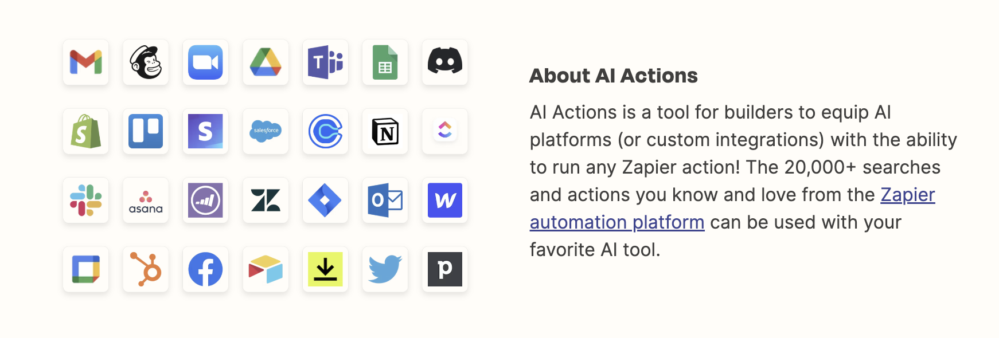

<div align="center">

[](https://zapier.com)

# [Zapier](https://zapier.com)<a id="zapier"></a>

No description provided (generated by Openapi Generator https://github.com/openapitools/openapi-generator)

</div>

## Table of Contents<a id="table-of-contents"></a>

<!-- toc -->

- [Installation](#installation)
- [Getting Started](#getting-started)
- [Reference](#reference)
  * [`zapieractions.action.executeAppAction`](#zapieractionsactionexecuteappaction)
  * [`zapieractions.action.listExposedActions`](#zapieractionsactionlistexposedactions)
  * [`zapieractions.check.authTestGet`](#zapieractionscheckauthtestget)
  * [`zapieractions.configuration.getConfigurationLink`](#zapieractionsconfigurationgetconfigurationlink)
  * [`zapieractions.log.getExecutionLog`](#zapieractionsloggetexecutionlog)

<!-- tocstop -->

## Installation<a id="installation"></a>
<div align="center">
  <a href="https://konfigthis.com/sdk-sign-up?company=Zapier&serviceName=AI%20Actions&language=TypeScript">
    
  </a>
</div>

## Getting Started<a id="getting-started"></a>

```typescript
import { ZapierActions } from "zapier-actions-typescript-sdk";

const zapieractions = new ZapierActions({
  // Defining the base path is optional and defaults to https://actions.zapier.com
  // basePath: "https://actions.zapier.com",
  accessPointApiKeyHeader: "API_KEY",
  accessPointApiKeyQuery: "API_KEY",
  sessionAuth: "API_KEY",
});

const executeAppActionResponse = await zapieractions.action.executeAppAction({
  exposedAppActionId: "01ARZ3NDEKTSV4RRFFQ69G5FAV",
  instructions: "instructions_example",
  preview_only: false,
});

console.log(executeAppActionResponse);
```

## Reference<a id="reference"></a>


### `zapieractions.action.executeAppAction`<a id="zapieractionsactionexecuteappaction"></a>

Give us a plain english description of exact action you want to do. There should be dynamically generated documentation for this endpoint for each action that is exposed.

#### 🛠️ Usage<a id="🛠️-usage"></a>

```typescript
const executeAppActionResponse = await zapieractions.action.executeAppAction({
  exposedAppActionId: "01ARZ3NDEKTSV4RRFFQ69G5FAV",
  instructions: "instructions_example",
  preview_only: false,
});
```

#### ⚙️ Parameters<a id="⚙️-parameters"></a>

##### instructions: `string`<a id="instructions-string"></a>

Plain english instructions. Provide as much detail as possible, even if other fields are present.

##### exposedAppActionId: `string`<a id="exposedappactionid-string"></a>

##### preview_only: `boolean`<a id="preview_only-boolean"></a>

If true, we will not execute the action, but will return the params of the preview.

#### 🔄 Return<a id="🔄-return"></a>

[ExecuteResponse](./models/execute-response.ts)

#### 🌐 Endpoint<a id="🌐-endpoint"></a>

`/api/v1/exposed/{exposed_app_action_id}/execute` `POST`

[🔙 **Back to Table of Contents**](#table-of-contents)

---


### `zapieractions.action.listExposedActions`<a id="zapieractionsactionlistexposedactions"></a>

List all the currently exposed actions for the given account.

#### 🛠️ Usage<a id="🛠️-usage"></a>

```typescript
const listExposedActionsResponse =
  await zapieractions.action.listExposedActions();
```

#### 🔄 Return<a id="🔄-return"></a>

[ExposedActionResponseSchema](./models/exposed-action-response-schema.ts)

#### 🌐 Endpoint<a id="🌐-endpoint"></a>

`/api/v1/exposed` `GET`

[🔙 **Back to Table of Contents**](#table-of-contents)

---


### `zapieractions.check.authTestGet`<a id="zapieractionscheckauthtestget"></a>

Test that the API and auth are working.

#### 🛠️ Usage<a id="🛠️-usage"></a>

```typescript
const authTestGetResponse = await zapieractions.check.authTestGet();
```

#### 🌐 Endpoint<a id="🌐-endpoint"></a>

`/api/v1/check` `GET`

[🔙 **Back to Table of Contents**](#table-of-contents)

---


### `zapieractions.configuration.getConfigurationLink`<a id="zapieractionsconfigurationgetconfigurationlink"></a>

Provides a link to configure more actions. Alternatively, searching through apps and actions will provide more specific configuration links.

#### 🛠️ Usage<a id="🛠️-usage"></a>

```typescript
const getConfigurationLinkResponse =
  await zapieractions.configuration.getConfigurationLink();
```

#### 🌐 Endpoint<a id="🌐-endpoint"></a>

`/api/v1/configuration-link` `GET`

[🔙 **Back to Table of Contents**](#table-of-contents)

---


### `zapieractions.log.getExecutionLog`<a id="zapieractionsloggetexecutionlog"></a>

Get the execution log for a given execution log id.

#### 🛠️ Usage<a id="🛠️-usage"></a>

```typescript
const getExecutionLogResponse = await zapieractions.log.getExecutionLog({
  executionLogId: "01ARZ3NDEKTSV4RRFFQ69G5FAV",
});
```

#### ⚙️ Parameters<a id="⚙️-parameters"></a>

##### executionLogId: `string`<a id="executionlogid-string"></a>

#### 🔄 Return<a id="🔄-return"></a>

[ExecuteResponse](./models/execute-response.ts)

#### 🌐 Endpoint<a id="🌐-endpoint"></a>

`/api/v1/execution-log/{execution_log_id}` `GET`

[🔙 **Back to Table of Contents**](#table-of-contents)

---


## Author<a id="author"></a>
This TypeScript package is automatically generated by [Konfig](https://konfigthis.com)
